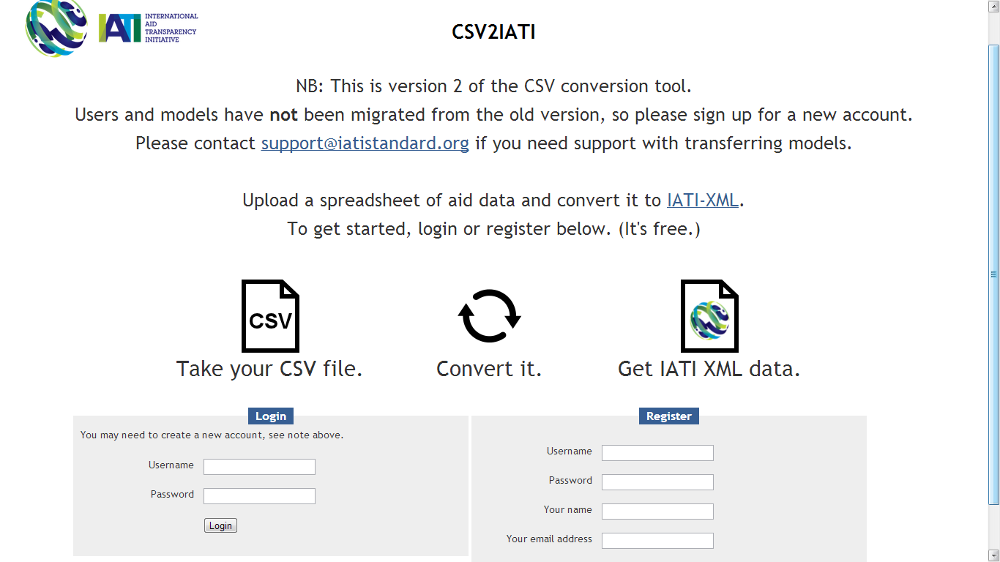
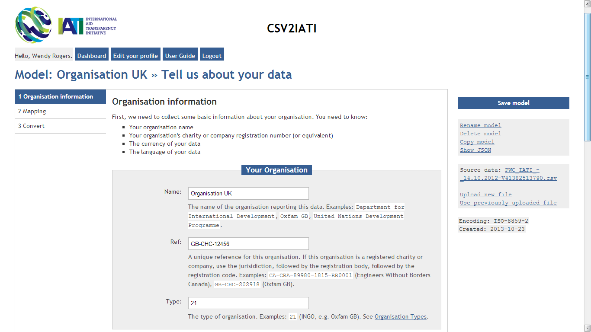
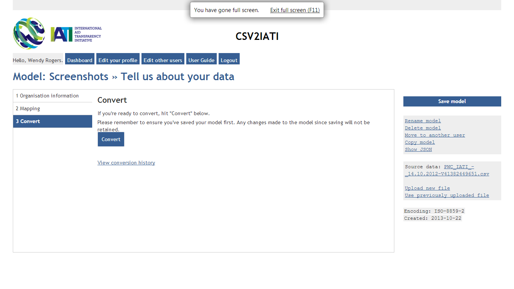
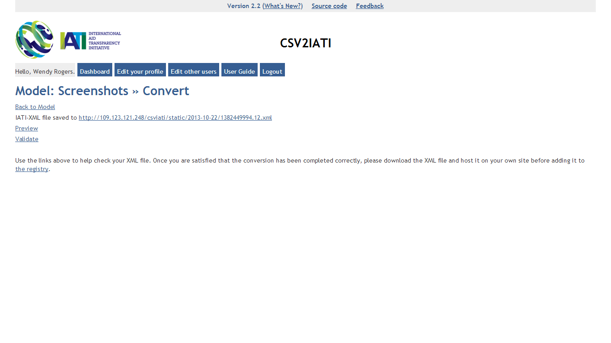
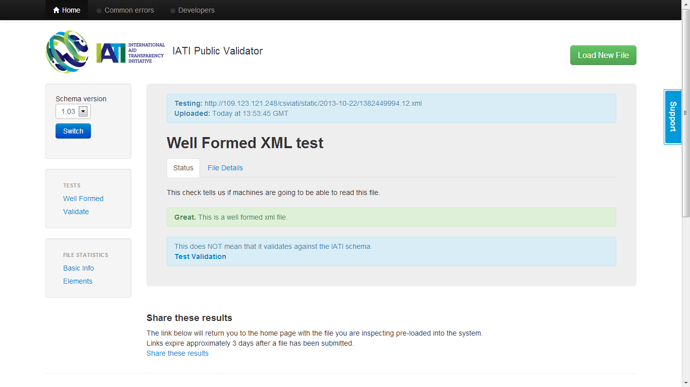

User Guide
==========

.. contents:: 

Summary
-------

The International Aid Transparency Initiative (IATI) is the recognised
common standard for aid data. As increasing numbers of organisations are
working to publish their aid data to IATI, the IATI Secretariat has been 
working on a number of tools to help make this process easier.

The IATI Conversion Tool is aimed at organisations that have too many
projects to enter manually into a web-entry platform, but not enough
projects to have in-house technical support that could help with
implementation. It aims to make publication less labour-intensive and
significantly increase capacity to publish more data from more
organisations.

Accessing the tool
------------------

To access the tool, visit http://csv2iati.iatistandard.org

Tool Support
------------------

If you have any questions about how to use the tool or queries about
implementation, please contact the IATI support team at
support@iatistandard.org

Map and convert data to IATI
----------------------------

The IATI CSV Conversion Tool provides a service to convert a CSV file of
aid data into an XML format defined by the IATI Standard (technically 
called “IATI-XML”). CSV files have to satisfy some minimum conditions 
for the way they are formatted, but the Conversion Tool is flexible enough 
to allow most organisations to convert their data without too much work.

To use the Conversion Tool you will need to:

#. Extract the required data from internal project management systems;

#. Make sure the data is in a single spreadsheet and saved in the CSV
   (“comma-separated values”) format [#]_.

#. Upload the data to the online Conversion Tool;

#. Map the columns in your CSV file to the IATI Standard fields (you
   don’t need to be too familiar with the Standard, but you should
   consult the IATI Activity Standard if you are unsure):
   http://iatistandard.org/activities-standard/overview

#. Check that you’re happy with the mapping you’ve created (you might
   want to share it around your organisation?);

#. Click “Convert” to create an output datafile of IATI-XML;

#. Click “Validate” to test that your resultant datafile contains only 
   valid IATI-XML and is consistant with the IATI Standard Schema.

#. When you’re happy with what you’ve created, you can 
   register your data with the IATI Registry.

Once you have created the mapping you can publish updated data
by simply uploading a new CSV file and clicking "Convert". 

The service is available as open-source software, so
organisations could run the service on their own web servers to convert
directly out of their internal systems.

.. [#] There are other preconditions required for your CSV data: see below.

Technical preconditions for the data
------------------------------------

The tool has certain preconditions for how the data must initially be
formatted in order to be converted:

a. The data must be in CSV ("comma-separated values") file format;

#. The data must be well-structured (e.g. no illegal characters;
   only values in “value” columns – so no € or $ signs or commas for example);

#. Data must use valid codelists as defined at
   http://iatistandard.org/codelists, and codes must be incorporated as
   a separate column in your data.

#. Data quality is the responsibility of the data provider – the
   conversion tool cannot provide any content cleaning or reconciliation
   services;

#. Multiple rows per activity are accepted but only of one field. So,
   you can have multiple transactions rows per activity OR multiple
   sector rows per activity, but currently not both;

#. Multiplicity of similar columns is accepted (e.g. title in English
   and French);

#. Columns can be named however the data publisher wants in the original
   CSV file.

Preparing your data
-------------------

Different organisations have different ways of storing and exporting
data, so the exact process you will need to undertake will vary.

**Firstly, export the data from your system. You need to have:**

#. All of the data in a single spreadsheet;

#. Multiple rows per activity if possible – for example, if you have
   multiple transactions for one activity or multiple sectors for one
   activity.

#. You can have as many columns in the data as you want, so if you have
   two titles in two different languages, you can export them both (e.g.
   as columns ``title_english`` and ``title_french``) and include them
   in your IATI data file.

#. Preferably export in "CSV" format. If you can't do this directly,
   then open the spreadsheet in Excel, go to File/Save As... and in the
   "Save as type" drop-down box, select "CSV" (comma-separated values).

**Then, you need to make sure you are using all the necessary
codelists. It is recommended that for any column that holds a value from
one of the IATI Standard codeslists, a second column is added that holds
the relevant codelist value description. For example:**

#. **Countries** – If you have one column stating the recipient country
   (it might be ``recipient_country``), make sure you have a second
   column stating the recipient country code (maybe
   ``recipient_country_code``). This should be the ISO-2 code found on
   the IATI Standard website:

   http://iatistandard.org/codelists/country

#. **Transactions** – If you have many rows with different types of
   transactions for each activity (e.g., one row for commitments and one
   row for disbursements), make sure you have a column that states the
   transaction type (the text – for example, Disbursement) and another
   column stating the transaction type code (e.g. ``D``). The
   transaction types and codes should be those stated on the IATI
   Standard website:

   http://iatistandard.org/codelists/transaction_type

#. For other elements in the IATI Standard, if all of your activities
   use the same classification (e.g., all of the same aid type, or
   finance type), then you do not have to include this in your data –
   you can state in the mapping user interface that all your activities
   use the same classification.

Example Input CSV Files
-----------------------

The Excel (.xls) and CSV (.csv) spreadsheets provide samples of templates that can be used. These are not meant to be prescriptive, but aim to give an idea of how data should be structured. The templates demonstrate how to use a single row per activity being reported (spreadsheets  containing '1') and how to have multiple rows per activity (containing '2'). There are two versions of each spreadsheet in order to demonstrate the formatting differences between Excel (IATI data template example) and CSV (IATI data for converting) files, as the latter is required by the conversion tool.

* :download:`IATI data for converting 1 - single activity rows.csv`
* :download:`IATI data for converting 2 - multiple transaction rows.csv`
* :download:`IATI data template example 1 - single activity rows.xls`
* :download:`IATI data template example 2 - multiple transaction rows.xls`

Upload your data
----------------

#. Log on to http://csv2iati.iatistandard.org

#. Register to create an account (it's free, and with the exception of
   administrators, only you will be able to see your own data).

#. Once you're logged in, create a "model", which describes how the
   columns in your CSV file relates to the fields in the IATI Standard. 
   Just give the model a name and select your CSV file to upload.

#. At this point, the service will do some basic checks on your data, to
   make sure that it is provided in the CSV format. It will also
   detect other things like the character encoding in your data.

#. If you upload the wrong file, don't worry – just upload another
   one.
   

Provide some basic information about your organisation
-------------------------------------------------------

#.  Provide the name of your organisation, the unique organisation ID
    according to the IATI Standard and the type of your organisation.
    The unique organisation ID, if you are an official donor, is
    available from the IATI Standard website at:

    http://iatistandard.org/codelists/organisation

    If you are not an official donor then your organisation ID is generated
    as described at:
    
    http://iatistandard.org/getting-started/organisation-data/organisation-identifiers/

    However, please contact IATI Support if you are unsure about this.

#. Provide the default currency for your data and the language it's
   recorded in.

#. Finally, select the data structure that your uploaded data is
   provided in. Are there multiple transaction-rows per activity, or
   multiple sector-rows? Or, do you just have one row per activity?

Map your data
-------------

.. figure:: IATI-CSV2IATI-Mapping.png
   :scale: 50

#. From the left-hand side navigation, click on "**2. Mapping**\ ".

#. This part looks slightly complicated, but it's actually relatively
   straightforward. Using the user interface, you describe how your
   data relates to the IATI Standard.

#. The default screen shows the list of elements that you can
   use in converting your IATI data.

#. For each part of the IATI Standard – each field in each element or
   dimension – select the column that contains
   the relevant data from the drop-down box.

   a. For example, if you are looking at the Title element, select the
      column that contains the project title in your uploaded file.

   #. If you're looking at more complex elements, for example, Sector,
      which contains several parts (the text of the sector name, the
      code for the sector, the percentage of the project assigned to
      that sector), then again, for each part, select the column in your
      data that contains that information.

   #. In some cases, you will have information that is the same for all
      your activities – for example, the funding organisation. In that
      case, you can click to change the "Change Type" field to 'Fixed'
      alongside the relevant field and then enter the relevant value into
      the field box. You can switch back again to choose a column 
      by clicking and selecting "Column" at any time. 

#. If there are some fields or dimensions that are not relevant to your
   data, you can click the rubbish bin next to the field or the "Delete
   this element" link to delete the entire element.

#. You can save your mapping at any time and come back to it later. Just
   click the blue "Save model" button on the right hand side.

Convert your data
-----------------

#. When you're ready to convert your data, first make sure you've saved
   your mapping by clicking the blue "Save model" button on the right
   hand side.

#. Then, from the left hand side navigation, click "**3. Convert**\ ".
   You may have to scroll down to see this link.

#. Click the big blue "Convert" button. Depending on the size of your
   data, it may take a few minutes for the process to complete. Do not
   reload your browser in this time or click the button again, as it
   will have to start again.
   
#. If the conversion was unsuccessful, you will be informed of any
   errors. If you do not understand them (or what action you need to take),
   please contact IATI Support, providing details about any errors 
   that may have been provided.

#. If the conversion was successful, you will be able to access your
   converted IATI-XML data via the URL link displayed. 
   
#. You can always find the names of the files created during the 
   conversion process by clicking on the 'View Conversion History'
   link on the Conversion page.
   
     

Validate your IATI-XML File
---------------------------

#. Once you have converted your model successfully, we recommend that 
   you click on the 'Validate' link. This will check that your file is 
   using valid XML syntax. If this check is unsuccessful you will be informed
   of any errors which you should try to correct. You can find more details about
   any errors by clicking on the 'Extra Info' tab. If you still need any help 
   please contact the IATI Support Team as above.
   

   
#. If the validation was successful, we also recommend that you click on 
   the 'Test Validation' link. This will check that your file also conforms 
   to the IATI Standard Schema. If this check is unsuccessful you will be
   provided with details of any errors (via the 'Extra Info Tab') which 
   you should try to correct. This may mean that you have to amend the data 
   in your original CSV file.

Download your new datafile
---------------------------------

#. Once you have validated your model successfully you can download
   your IATI-XML file to wherever you host your IATI files (ideally 
   on your own servers). NB Don't forget to update your IATI Registry  
   account details if you have changed the location or name(s) of your 
   published IATI files.
   
   
Uploading and converting new data
---------------------------------

#. When it is time to update your pulished informatio,you can do this without
   mapping your data all over again. It is not necessary to create a new
   model as you can simply reuse your orignal model, just updating it
   as necessary with any changes you may have made to your data in the new 
   input CSV file.

#. Simply logon to your account and open the model that you have
   previously created

#. Click "Upload new file", select the file, and click Upload. Your new
   file will be selected by default.

#. If the data is structured in exactly the same way,  just click
   "3. Convert" from the left hand side navigation and your data will be
   converted.
   
#. Also, use the 'Validate' option to check that your new IATI-XML
   file is using valid XML that matches the IATI Standard.

