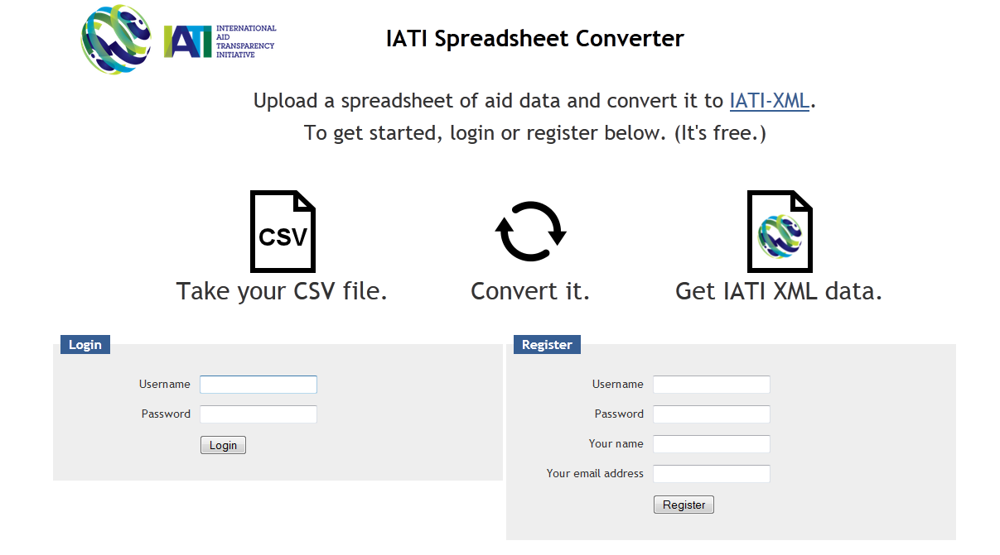

.. figure:: iati_conversion_tool_html_5218c5df.png
   :alt: 

IATI Conversion Tool
====================

Summary
-------

The International Aid Transparency Initiative (IATI) is the emerging
common standard for aid data. As increasing numbers of organisations are
working to publish their aid data to IATI during 2012, the IATI
Secretariat has been working on a number of tools to help make this
process easier.

The IATI Conversion Tool is aimed at organisations that have too many
projects to enter manually into a web-entry platform, but not enough
projects to have in-house technical support that could help with
implementation. It will make publication less labour-intensive and
significantly increase capacity to publish more data from more
organisations.

Map and convert data to IATI
----------------------------

The IATI Conversion Tool provides a service to convert a spreadsheet of
aid data into the IATI format (technically called “IATI-XML”).
Spreadsheets will have to satisfy some minimum conditions for the way
they are formatted, but the Conversion Tool is flexible enough to allow
a broad range of organisations to convert their data without much work
required in advance.

To use the Conversion Tool, you will need to:

#. Extract the data from your internal project management system;

#. Make sure the data is a single spreadsheet, and saved in the CSV
   (“comma-separated values”) format [#]_.

#. Upload the data to the Conversion Tool website;

#. Map the columns in your data across to the IATI Standard fields (you
   don’t need to be too familiar with the Standard, but you should
   consult the IATI Activity Standard if you are unsure:
   http://iatistandard.org/activities-standard/overview

#. Check that you’re happy with the mapping you’ve created (you might
   want to share it around your organisation);

#. Click “Convert” and your will receive your data back as IATI-XML.

#. If you’re happy with what you’ve created, you will be able to
   register your data with the IATI Registry.

Organisations can use the mapping they’ve created for frequently
re-publishing updated data, by simply uploading a new CSV file and
clicking "Convert". The service is available as open-source software, so
organisations could run the service on their own web servers to convert
directly out of their internal systems.

.. [#] There are other preconditions required for your data: see below.

Accessing the tool
------------------

To access the tool, visit http://csv2iati.iatistandard.org

If you have any questions about how to use the tool or queries about
implementation, please contact The IATI support team at
support@iatistandard.org

Technical preconditions for the data
------------------------------------

The tool has certain preconditions for how the data must initially be
formatted in order to be converted:

a. The spreadsheet must be in the CSV ("comma-separated values") format;

#. The spreadsheet must be well-structured (e.g. no illegal characters;
   only values in “value” columns – so no € or $ signs, for example);

#. Data must use valid codelists as defined at
   http://iatistandard.org/codelists, and codes must be incorporated as
   a separate column in your data.

#. The data quality is the responsibility of the data provider – the
   conversion tool will not provide any cleaning or reconciliation
   services;

#. Multiple rows per activity are accepted, but only of one field. So,
   you can have multiple transactions rows per activity OR multiple
   sector rows per activity, but not both;

#. Multiplicity of similar columns is accepted (e.g. title in English
   and French);

#. Columns can be named however the data provider wants in the original
   spreadsheet.

Preparing your data
-------------------

Different organisations have different ways of storing and exporting
data, so the exact process you will need to undertake will vary.

**Firstly, export the data from your system. You need to have:**

#. All of the data in a single spreadsheet;

#. Multiple rows per activity if possible – for example, if you have
   multiple transactions for one activity, or multiple sectors for one
   activity.

#. You can have as many columns in the data as you want, so if you have
   two titles in two different languages, you can export them both (e.g.
   as columns \`title\_english\` and \`title\_french\`) and include them
   in your IATI data file.

#. Preferably export in "CSV" format. If you can't do this directly,
   then open the spreadsheet in Excel, go to File/Save As... and in the
   "Save as type" drop-down box, select "CSV (comma-separated values).

**Then, you need to make sure you are using all the necessary
codelists.**

#. **Countries –**\ If you have one column stating the recipient country
   (it might be \`recipient\_country\`), make sure you have a second
   column stating the recipient country code (maybe
   \`recipient\_country\_code\`). This should be the ISO-2 code found on
   the IATI Standard website:

   http://iatistandard.org/codelists/country

#. **Transactions** – If you have many rows with different types of
   transactions for each activity (e.g., one row for commitments and one
   row for disbursements), make sure you have a column the states the
   transaction type (the text – for example, Disbursement) and another
   column stating the transaction type code (e.g. \`D\`). The
   transaction types and codes should be those stated on the IATI
   Standard website:

   http://iatistandard.org/codelists/transaction_type

#. For other elements in the IATI Standard, if all of your activities
   use the same classification (e.g., all of the same aid type, or
   finance type), then you do not have to include this in your data –
   you can state in the mapping user interface that all your activities
   use the same classification.

Upload your data
----------------

#. Log on to http://csv2iati.iatistandard.org

#. Register to create an account (it's free, and with the exception of
   administrators, only you will be able to see your own data).

#. Once you're logged in, create a "model", which describes how your
   data relates to the IATI Standard. Just give it a name, and select
   your data file to upload.

#. At this point, the service will do some basic checks on your data, to
   make sure that it is provided in the CSV format, and it will also
   detect some other things like the character encoding in your data.

#. If you upload the wrong file, don't worry – you can upload another
   one later on.

Provide some basic information about your organisation
......................................................

.. figure:: iati_conversion_tool_html_7f330693.png
   :width: 600px
   :scale: 100
   :alt: 

#.  Provide the name of your organisation, the unique organisation ID
    according to the IATI Standard, and the type of your organisation.
    The unique organisation ID, if you are an official donor, is
    available from the IATI Standard website at:

    http://iatistandard.org/codelists/organisation

    If you are not an official donor, then your organisation ID takes the
    following format:

    [Your country of registration's ISO-2 code]-[National registration body
    you are registered with (e.g. company or charity register)]-[The
    national registration body's unique ID for your organisation]

    For example:

        GB-CHC-202918 (United Kingdom, Charity Commission, Oxfam GB)

        Contact the IATI Secretariat if you are unsure about this.

#. Then provide the default currency for your data and the language it's
   provided in.

#. Finally, explain the data structure that your uploaded data is
   provided in. Are there multiple transaction-rows per activity, or
   multiple sector-rows? Or, do you just have one row per activity?

Map your data
-------------

.. figure:: iati_conversion_tool_html_13e89131.png
   :width: 600px
   :scale: 100
   :alt: 

#. From the left-hand side navigation, click on "**2. Mapping**\ ".

#. This part looks slightly complicated, but it's actually relatively
   straightforward. Using the user interface, you can describe how your
   data relates to the IATI Standard.

#. The default screen will show you the list of elements that you could
   use in converting your IATI data.

#. For each part of the IATI Standard – each field in each element or
   dimension – from the drop-down box, select the column that contains
   the relevant data.

   a. For example, if you are looking at the Title element, select the
      column that contains the project title in your uploaded file.

   #. If you're looking at more complex elements, for example, Sector,
      which contains several parts (the text of the sector name, the
      code for the sector, the percentage of the project assigned to
      that sector), then again, for each part, select the column in your
      data that contains that information.

   #. In some cases, you will have information that is the same for all
      your activities – for example, the funding organisation. In that
      case, you can click to change the type of data by clicking "to
      fixed value" alongside the relevant field. You can switch back
      again to choose a column by clicking "to column in data".

#. If there are some fields or dimensions that are not relevant to your
   data, you can click the rubbish bin next to the field or the "Delete
   this dimension" link to delete the entire dimension.

#. You can save your mapping at any time and come back to it later. Just
   click the blue "Save model" button on the right hand side.

Convert your data
-----------------

.. figure:: iati_conversion_tool_html_d72c78fe.png
   :width: 600px
   :scale: 100
   :alt: 

#. When you're ready to convert your data, first make sure you've saved
   your mapping by clicking the blue "Save model" button on the right
   hand side.

#. Then, from the left hand side navigation, click "**3. Convert**\ ".
   You may have to scroll down to see this link.

#. Click the big blue "Convert" button. Depending on the size of your
   data, it may take a few minutes for the process to complete. Do not
   reload your browser in this time or click the button again, as it
   will have to start again.

#. If the conversion was successful, you will be able to download your
   converted IATI-XML data via a public link, or else register that
   manually with the IATI Registry. Make a note of the address of the
   data.

#. If the conversion was unsuccessful, you should be informed of the
   errors. If you do not understand them (or what to do about it),
   please get in touch with the IATI Secretariat, providing details
   about the page you were on at the time and any errors that may have
   been provided.

Uploading and converting new data
---------------------------------

#. Once you've described how your data relates to the Standard, you
   might want to publish again once a month. You can do this without
   mapping your data all over again.

#. When you open a model, in the top right hand corner you'll see the
   following:

   .. figure:: iati_conversion_tool_html_50a4edec.png
      :alt: 

#. Click on the Change... link and you will see all of the files that
   you have uploaded so far.

#. Click "Upload new file", select the file, and click Upload. Your new
   file will be selected by default.

#. If the data is structured in exactly the same way, you can just click
   "3. Convert" from the left hand side navigation and your data will be
   converted.

